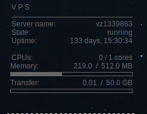

#ConkyServerStatus
Basic commandline script to be used with conky (http://conky.sourceforge.net/) to show a specific glesys
servers status directly on your desktop. The below image shows what it currently looks like on my desktop.

##Configuration
The configuration file should be placed in the same directory you intend to run the program from. 
It must be named glesys.conf.

    [ConkyServerStatus]
    apikey = xxxxx
    apiuser = clXXXXX
    apiserver = vzXXXXX
    apiurl = https://api.glesys.com/server/status

###Bash script
I use the following bash script placed inside my local bin/ to run the script.

    #!/bin/bash
    cd ~/code/python/GlesysAPI/Python/ConkyServerStatus/
    python conkyserverstatus.py

###Conky Usage:
Place the following snippet in your .conkyrc or equivalent file. It will update every 5 minutes.

    V P S
    ${hr}
    ${execpi 300 glesys_status}

